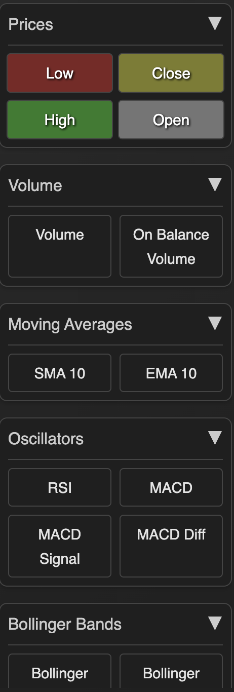

# Stock Data Aggregator & Visualizer

This is a self-hosted application designed to aggregate stock data from multiple sources (e.g., yfinance) and store it locally in an SQLite3 database. It features a FastAPI backend and a React frontend, allowing users to interact with S&P 500 stock data, visualize key indicators through customizable charts, and adjust the stock grid dynamically.


## Features

- **Data Aggregation**: Fetches S&P 500 stock data, stores it in `stock_data.db`.
- **Visualization**: Line and waterfall charts to explore stock trends.
- **Dynamic Stock Grid**: Customize the stock grid and update data as needed.
- **Local Storage**: SQLite3 database for local data management.



## Setup Instructions

### Step 1: Clone the Repository

```bash
git clone https://github.com/your-username/stock_indicators.git
cd stock-aggregator
```

### Step 2: Python Environment Setup

1. Create and activate a virtual environment:
   ```bash
   python3 -m venv venv
   source venv/bin/activate
   ```
2. Install dependencies:
   ```bash
   pip install -r requirements.txt
   ```

### Step 3: Populate the SQLite Database

```bash
python puller.py
```

This fetches stock data and creates `stock_data.db`.

### Step 4: Frontend Setup

Navigate to the `frontend` directory and install dependencies:

```bash
cd frontend/src
npm install
npm run build
```

### Step 5: Run the Backend

In a separate terminal, start the FastAPI backend:

```bash
python3 main.py
```

### Access the Application

- Application: [http://localhost:8000](http://localhost:8000)
